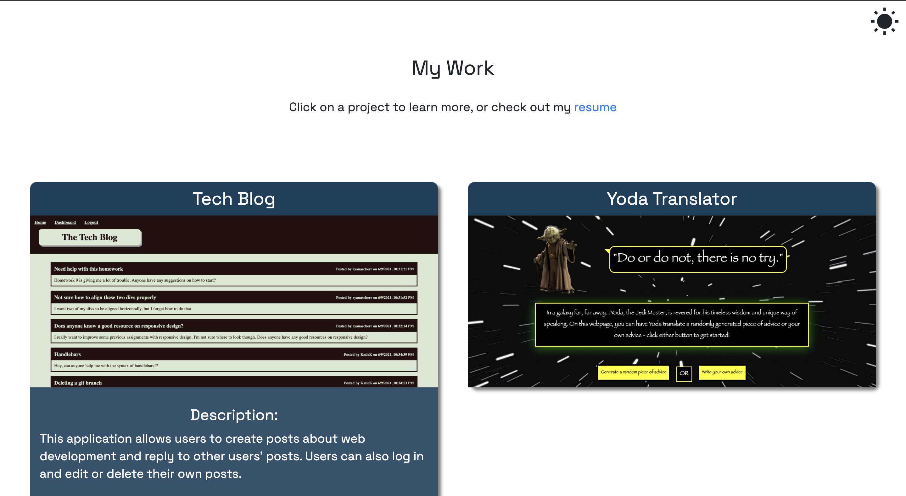

# Ryan Scherr's Portfolio Page

## Description

This portfolio page was created to show off Ryan Scherr's ablities as a coder. The webpage will be updated throughout his time in JHU's program with new techniques, languages, and more. The end goal is for him to be able to use this page to appear as hireable and competitive to potential employers, hopefully leading to a new job.

The page tells users a short bit about Ryan's history, shows off projects he has made, and gives several ways to contact him. A navigation bar at the top of the page allows users to quikly jump to the information they are seeking, and clicking on images of his projects will take users to them. In addition, the HTML on this page were written with semantics in mind, ensuring high accessibility.

## Installation

There is no installation required to use this webpage.

## Usage

Users can scroll up and down the page to view the listed information. Alternatively, they can use the navigation bar at the top of the page to move to the desired location. They can also click on the images to be taken to Ryan's project pages.

## Technologies Used

HTML, CSS, JS, Materialize

## Link

https://ryanascherr.github.io/portfolio/

## Contact Information

ryanascherr@gmail.com
https://github.com/ryanascherr
https://www.linkedin.com/in/ryanascherr/
