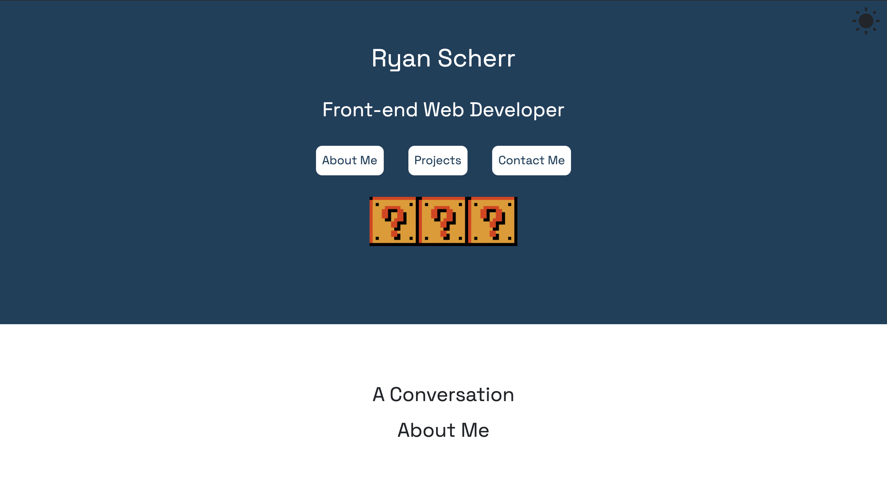
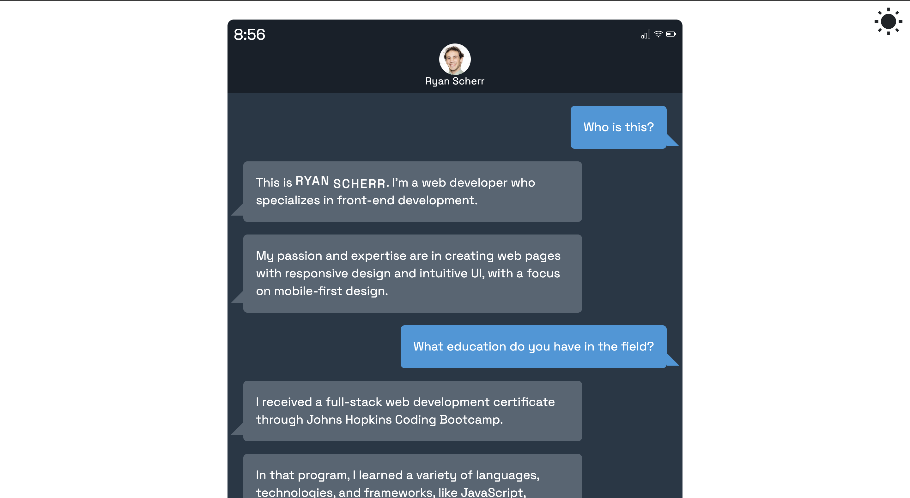

# Ryan Scherr's Portfolio Page

## Description

Welcome to my portfolio page! Here, you can find information about me, projects I've made, and ways to contact me. You'll also see my wonderful coding skills on display.

## Usage

Users can scroll up and down the page to view the listed information. Alternatively, they can use the navigation bar at the top of the page to move to the desired location. Links to all of my projects and repositories are on display. In addition, users can easily switch between light mode and dark mode by clicking the sun or moon on the top right corner of the page.

## Technologies Used

HTML, CSS, JS, Materialize

## Link

https://ryanascherr.github.io/portfolio/

## Contact Information

ryanascherr@gmail.com
